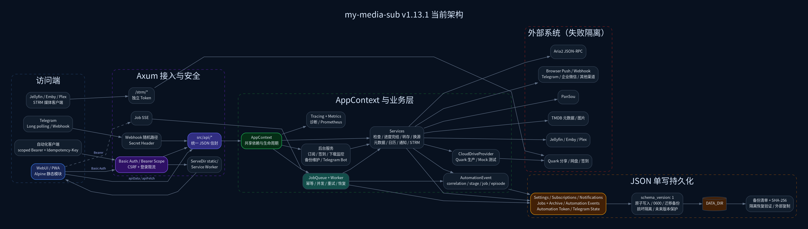

# My Media Sub

> 夸克网盘上的媒体追更工作台：搜索、订阅、转存、重命名、下载与通知，一条链路跑通。

[](https://github.com/hellomrli/my-media-sub/actions/workflows/ci.yml)
[](https://github.com/hellomrli/my-media-sub/releases)
[](https://github.com/hellomrli/my-media-sub/pkgs/container/my-media-sub)
[](https://www.rust-lang.org/)
[](LICENSE)

追剧不必反复点开分享链接。My Media Sub 把「发现资源 → 盯住更新 → 自动转存 → 整理命名 → 可选下载 → 及时通知」收成一个可自托管的小服务：

- **Rust + Axum** 单二进制后端，无外部数据库，数据落在本地 JSON（原子写入 + 自动备份）；
- **无打包器 WebUI**（Alpine.js + Tailwind，Cinema Slate 视觉），可安装为 PWA；
- **Docker 一键拉起**，容器非 root，默认拒绝弱密码。



---

## 功能总览

| 你想解决的事 | 它怎么做 |
|---|---|
| 自动追更 | 定时/手动检查分享；按季与起始集过滤；同集多版本择优；识别缺集与完结；分享探测分页拉全并显式标记截断 |
| 自动转存 | 业务级幂等（重试不重复转存）；电影/剧集/动画目录归类；规则过滤、模板重命名、批量修复命名 |
| 分享失效 | 失效计数、候选评分、进度校验、冷却与自动换源，全程可回滚审计 |
| 找资源 | PanSou 聚合搜索、夸克分享探测与质量评分、TMDB 元数据（海报、年份、评分、总集数） |
| 看排期 | 上海时区周/月/列表日历；按元数据推断排期；逐集处理状态一目了然 |
| 下到本地 | Aria2 幂等提交、批量分批、退避重试 |
| 心里有数 | 持久化任务队列、真实取消、心跳看门狗、优雅停机、SSE 实时状态、结构化自动化事件流水线 |
| 消息触达 | 企业微信 / Telegram / Bark / Gotify / WxPusher / PushPlus / Server 酱；Browser Push；签名 Webhook；安静时段与摘要聚合 |
| 手机遥控 | Telegram Bot：白名单、写操作二次确认、限流与审计 |
| 敢上生产 | 原子 JSON Store、损坏隔离 + 显式告警、自动备份与恢复验证、关联日志、Prometheus 指标 |

STRM 相关能力自 v2.2.0 起暂时下线，旧字段保留，方便以后以独立模块接回。

---

## 快速开始

### 方式一：Docker Compose（推荐）

```bash
mkdir -p my-media-sub/{data,runtime} && cd my-media-sub
curl -LO https://raw.githubusercontent.com/hellomrli/my-media-sub/main/docker-compose.yml

# 同目录写入管理员密码（必需，勿使用 change-me）
printf 'SERVER_PASSWORD=replace-with-a-strong-password\nTZ=Asia/Shanghai\n' > .env
docker compose up -d
```

浏览器打开 `http://服务器地址:56001`，用户名默认 `admin`。

> **从 v2.0.0 起，默认密码不可登录。** 必须通过 `SERVER_PASSWORD` / `APP_PASSWORD` 或系统设置配置真实密码。

容器以 uid/gid `1000` 运行；入口脚本会自动修正挂载目录属主。业务数据位于 `data/`，可在线更新的二进制和 WebUI 位于独立的 `runtime/`，容器重启或重建后仍会保留。

首次从旧镜像迁移到支持 Docker 在线更新的版本，仍需先执行一次镜像升级。之后可在「系统设置 → 维护 → 在线更新」直接切换 Release；升级器会校验 SHA256、同时替换二进制与完整 WebUI，并在后台任务优雅停机后重启进程。

常用运维命令：

```bash
docker compose ps            # 状态
docker compose logs -f       # 日志
docker compose pull && docker compose up -d   # 更新基础镜像和系统库
docker compose down          # 停止
```

Compose 默认限制容器日志为 `10m × 3`（json-file 驱动）。日志只写 stdout，不设上限的话长期运行会在宿主机上无界增长。

### 方式二：Docker Run

```bash
docker run -d \
  --name my-media-sub \
  --restart unless-stopped \
  -p 56001:56001 \
  -v "$(pwd)/data:/app/data" \
  -v "$(pwd)/runtime:/app/runtime" \
  -e SERVER_USERNAME=admin \
  -e SERVER_PASSWORD='replace-with-a-strong-password' \
  -e TZ=Asia/Shanghai \
  ghcr.io/hellomrli/my-media-sub:latest
```

生产环境请钉死版本标签。每个发布会同时打补丁与次版本标签（例如 `2.2.15` 与 `2.2`）：

```bash
docker pull ghcr.io/hellomrli/my-media-sub:2.2.15
docker image inspect ghcr.io/hellomrli/my-media-sub:2.2.15 --format '{{.RepoDigests}}'
```

`:latest` 只在 CI 全绿后才会更新——镜像发布工作流以 CI 成功为前置条件，并构建通过了 CI 的那个提交。

### 方式三：Linux 二进制

从 [GitHub Releases](https://github.com/hellomrli/my-media-sub/releases) 下载并校验：

```bash
VERSION=v2.2.15
curl -LO "https://github.com/hellomrli/my-media-sub/releases/download/${VERSION}/my-media-sub-${VERSION}-linux-x86_64.tar.gz"
curl -LO "https://github.com/hellomrli/my-media-sub/releases/download/${VERSION}/my-media-sub-${VERSION}-linux-x86_64.tar.gz.sha256"
sha256sum -c "my-media-sub-${VERSION}-linux-x86_64.tar.gz.sha256"
tar -xzf "my-media-sub-${VERSION}-linux-x86_64.tar.gz"
cd "my-media-sub-${VERSION}-linux-x86_64"

SERVER_PASSWORD='replace-with-a-strong-password' ./my-media-sub
```

运行目录需保留完整 `static/`。业务数据默认写在 `./data`，可用 `DATA_DIR` 改路径。

---

## 第一次打开时

1. 进入「系统设置」，确认管理员密码足够强。
2. 填入夸克 Cookie，用连接测试确认可用。
3. 配置电影、剧集、动画（以及你需要的自定义分类）目标目录。
4. 按需打开 PanSou、TMDB、Aria2 与推送渠道。
5. 在资源搜索里创建订阅，或直接粘贴分享链接。
6. 设定检查周期、并发、自动转存与换源策略。
7. 若前面有可信反向代理，再开启 `trust_proxy_headers`，登录限流才会按 `X-Forwarded-For` 计真实客户端；直连部署请保持关闭（默认）。

---

## 一条检查会经历什么

```text
定时器 / 手动检查
  → 批量互斥 + 同订阅互斥 + 并发限制
  → 分享探测（分页拉全，截断显式标记 partial）
  → 规则过滤 → 季度匹配 → 同集择优
  → 检查结果按字段合并回写（不踩并发转存、完结状态与用户编辑）
  → 幂等 SubscriptionTransfer Job（高 / 中 / 低加权公平）
  → 夸克转存（执行前按已转存状态过滤，成功即落盘）
  → 重命名 → 可选 Aria2 → 通知
  → AutomationEvent 流水线审计
```

设计上偏「宁可慢一点，也不要悄悄写错」：

- 转存具备业务级幂等：任务重试/重放会跳过已转存文件，不在网盘制造重复内容。
- 可重试错误最多 3 次指数退避（带抖动）；连续临时故障会熔断，冷却后再探测恢复。
- 心跳看门狗：超过 30 分钟毫无进度才判卡死；取消会真正中止任务并立刻释放并发槽。
- SIGTERM / Ctrl+C：拒收新任务，给运行中任务约 30 秒落盘，残留收敛为可手动重试的中断态。
- 通知支持路由、最低级别、安静时段（主机时区）、限频与延迟摘要；摘要可跨重启；失效的浏览器推送端点会自动清理。

---

## 配置

日常配置优先走 WebUI。环境变量更适合容器启动参数与初始账号：只覆盖非空值，不会用空字符串把已保存的密钥冲掉。

### 基础环境变量

| 变量 | 默认 | 说明 |
|---|---:|---|
| `SERVER_HOST` | `0.0.0.0` | 监听地址 |
| `SERVER_PORT` | `56001` | HTTP 端口 |
| `SERVER_USERNAME` | `admin` | 初始管理员账号 |
| `SERVER_PASSWORD` | 无（必填） | 管理员密码；未设置或仍为默认值时拒绝登录 |
| `DATA_DIR` | `./data` | JSON 数据、备份与运行状态 |
| `SELF_UPDATE_ENABLED` | Docker 为 `true` | 是否开放当前运行目录的在线更新能力 |
| `SELF_UPDATE_BACKUP_RETENTION` | `3` | 在线更新二进制和 `static/` 各自保留的回滚副本数（1–20） |
| `APP_RUNTIME_DIR` | Docker 为 `/app/runtime` | Docker 可写二进制与更新元数据目录；高级部署项 |
| `STATIC_DIR` | `./static`；Docker 为 `/app/runtime/static` | WebUI 静态资源目录 |
| `BACKUP_INTERVAL_HOURS` | `24` | 自动备份间隔；`0` 关闭 |
| `BACKUP_VERIFY_INTERVAL_HOURS` | `24` | 备份隔离恢复验证间隔；`0` 关闭 |
| `BACKUP_EXTERNAL_DIR` | 空 | 校验后原子复制到外部目录 |
| `BACKUP_RETENTION` | `7` | 服务器侧保留份数 |
| `RUST_LOG` | `info` | 日志过滤 |
| `LOG_FORMAT` | `text` | `json` 时输出带关联上下文的 JSON 日志 |
| `SLOW_OPERATION_MS` | `1000` | 慢操作阈值（100–300000 ms） |
| `TZ` | 系统时区 | 容器建议 `Asia/Shanghai` |

保留策略（`RETENTION_*`）与备份容量（`BACKUP_MAX_*`、`STORE_GROWTH_WARNING_MB`）见 [`.env.example`](.env.example)。

### 常见集成变量

| 类型 | 变量 |
|---|---|
| 夸克 | `QUARK_COOKIE`、`QUARK_SIGNIN_COOKIE`、`QUARK_SIGNIN_ENABLED`、`QUARK_SIGNIN_HOUR` |
| 搜索 | `PANSOU_API_URL` |
| Aria2 | `ARIA2_RPC_URL`、`ARIA2_SECRET`、`ARIA2_MOVIE_DIR`、`ARIA2_SERIES_DIR`、`ARIA2_ANIME_DIR` |
| TMDB | `TMDB_API_KEY`、`TMDB_LANGUAGE` |
| 推送 | `WECOM_BOT_URL`、`TELEGRAM_BOT_TOKEN`、`TELEGRAM_CHAT_ID`、`WXPUSHER_APP_TOKEN`、`WXPUSHER_UIDS`、`BARK_URL`、`GOTIFY_URL`、`GOTIFY_TOKEN`、`PUSHPLUS_TOKEN`、`SERVERCHAN_KEY` |
| Telegram Bot | `TELEGRAM_BOT_MODE`、`TELEGRAM_BOT_ALLOWED_USER_IDS`、`TELEGRAM_BOT_ALLOWED_CHAT_IDS`、`TELEGRAM_BOT_PRIVATE_ONLY`、`TELEGRAM_BOT_WEBHOOK_PUBLIC_URL`、`TELEGRAM_BOT_WEBHOOK_PATH_SECRET`、`TELEGRAM_BOT_WEBHOOK_SECRET` |

### 只能通过设置 API 配置的功能

以下能力后端完整可用，但**目前没有 WebUI 入口**，需要直接 `POST /api/settings`：

| 功能 | 设置项 | 说明 |
|---|---|---|
| 反代信任 | `trust_proxy_headers` | 见「安全与部署建议」 |

这是部署级设置，按部署环境一次配好即可，不计划提供界面入口。

---

## 安全与部署建议

v2.x 默认基线：

- 拒绝默认密码；未配置密码无法登录。
- 登录限流默认按连接对端 IP；`X-Forwarded-For` 仅在显式开启 `trust_proxy_headers` 后信任。自动化 Token 认证失败同样计入限流。
- 自动化 Token 最小 scope + 读路径白名单，未列出的接口默认拒绝。
- 容器非 root；密钥在 UI 中固定长度掩码。
- 浏览器写请求有同源 / CSRF 防护；默认启用 CSP 与安全响应头。

请务必：

- 不要把 `data/`、Cookie、Token、`.env` 提交进 Git。
- 公网访问放在反向代理 + HTTPS 之后，参见 [HTTPS 反向代理指南](docs/https-reverse-proxy.md)。
- 出事前先在「系统诊断」里下载完整备份；恢复前可用预览与脱敏诊断包。

---

## 数据放在哪里

```text
data/
├── settings.json
├── subscriptions.json
├── notifications.json
├── jobs.json
├── jobs.archive.json
├── automation_events.json
├── telegram_bot.json
└── backups/
    └── verification.json
```

存储是带 `schema_version` 的 JSON 信封：临时文件写入 → `fsync` → 原子 rename；写盘成功后才替换内存；Unix 上文件权限 `0600`。损坏文件会被隔离为 `*.json.corrupt-*` 并**显式告警**：启动时发站内通知，`/api/diagnostics` 数据一致性检查会持续报告，直到你核对备份并清理隔离文件。任务裁剪只淘汰终态任务，排队与运行中的不会被顺手清掉。

Docker 的 `runtime/` 不属于业务数据备份，包含当前二进制、完整 `static/`、版本标记和升级回滚副本。它必须保持 uid/gid `1000` 可写；详细的初始化、镜像/在线更新优先级与恢复方式见 [Docker 在线更新说明](docs/docker-online-update.md)。

---

## API 与可观测性

| 用途 | 入口 |
|---|---|
| 存活 | `GET /health` |
| 指标 | `GET /metrics`（Prometheus）；JSON 指标快照包含在 `GET /api/diagnostics` 的 `metrics` 字段中 |
| 日志过滤 | `GET\|PUT /api/observability/log-filter` |
| 诊断 | `GET /api/diagnostics`、`GET /api/diagnostics/export` |
| 备份 | `GET /api/backups/export`、`POST /api/backups/preview`、`GET\|POST /api/backups/verification`、`POST /api/backups/restore` |
| 存储清理 | `GET\|POST /api/storage/cleanup`、`GET /api/storage/decision` |
| 自动化 Token | `GET\|POST\|DELETE /api/automation-token` |
| 订阅交换 | `GET /api/subscriptions/export`、`POST /api/subscriptions/import/preview\|import` |
| 实时任务 | `GET /api/jobs/events`（SSE） |
| 日历 / 流水线 | `GET /api/calendar`、`GET /api/automation/events` |

响应统一信封：

```json
{"ok": true, "data": {}}
{"ok": false, "error": "validation_error", "message": "..."}
```

路由表与 `static/openapi.json` 由 `scripts/check-openapi.py` 双向强制同步：缺失、未注册和破坏性变更都会让 CI 失败，规范版本号也必须与 `Cargo.toml` 一致。完整契约见 [`docs/api-contract.md`](docs/api-contract.md)，以及运行中的 OpenAPI 页面 `/api-docs.html`。

---

## 从源码构建

需要：Rust stable（edition 2021）、Node.js（前端测试、lint 与模板组装）。可选 Docker、Tailwind standalone CLI（改样式）、Graphviz（重绘架构图）。

```bash
cp .env.example .env
cargo run --release
```

与 CI 一致的完整检查：

```bash
# 前端：产物新鲜度 → 语法 → 测试 → lint
node scripts/build-frontend.mjs --check
find static -type f -name '*.js' -print0 | sort -z | xargs -0 -n1 node --check
node --test tests/frontend_*.test.js
npx --yes eslint@10.8.0 'static/**/*.js'

# 契约
python3 scripts/check-openapi.py

# 后端
cargo fmt --all -- --check
cargo clippy --all-targets --all-features --locked -- -D warnings
cargo test --all --locked

cargo build --release --locked
docker build -t my-media-sub:dev .
```

ESLint 的 `no-undef` 是这套原生 JS 的静态安全网：模块作用域里的裸标识符在 `'use strict'` 下要等用户点击才抛 `ReferenceError`，`node --check` 和单元测试都抓不到。

冒烟脚本（`scripts/smoke-*.sh`）覆盖 release 二进制、Docker 入口、稳定性 soak、版本升级和真实浏览器 E2E。浏览器冒烟会断言 Alpine 真的完成了水合（`x-cloak` 全部被摘除、`x-show` 写入了行内样式），并把 console 的 `Uncaught` 与资源加载失败视为失败。

前端产物由脚本生成，**不要手改** `static/index.html` / `static/styles.css`：

```bash
node scripts/build-frontend.mjs          # index.html ← 模板 + partials
node scripts/build-frontend.mjs --check  # 校验产物是否过期（CI 会跑）
TAILWIND_BIN=/path/to/tailwindcss scripts/build-css.sh
```

改动任何静态资源后，同步 bump `static/service-worker.js` 的 `CACHE_VERSION`，否则 PWA 客户端可能继续命中旧缓存。

### 仓库结构（精简）

```text
src/
├── api/           HTTP 路由与响应契约
├── clients/       PanSou / 夸克 / Aria2
├── jobs/          持久化队列、调度与 Handler
├── models/        领域模型
├── services/      检查、转存、换源、日历、通知…
├── store/         原子 JSON Store
└── utils/         时间、文件、指标、正则缓存、脱敏

static/
├── index.tmpl.html + partials/   源模板
├── index.html / styles.css       生成物（勿手改）
└── js/                           core · stores · features
```

---

## 文档索引

- [架构](docs/architecture.md) · [API 契约](docs/api-contract.md) · [自动化事件](docs/automation-events.md)
- [自动化 API / Token / 导入导出](docs/automation-api.md) · [Telegram Bot](docs/telegram-bot.md)
- [媒体日历](docs/media-calendar.md) · [资源质量与换源](docs/source-quality.md)
- [HTTPS 与安全部署](docs/https-reverse-proxy.md) · [Docker 在线更新](docs/docker-online-update.md) · [PWA](docs/pwa.md)
- [存储扩展与 SQLite 决策](docs/storage-scaling.md)
- 代码评审：[工程质量](docs/code-review-2026-07-26.md) · [界面与功能设计](docs/frontend-design-review-2026-07-26.md)
- 当前版本：[v2.2.24 升级指南](docs/upgrade-v2.2.24.md) · 完整变更见 [CHANGELOG.md](CHANGELOG.md)

各版本升级步骤在 `docs/upgrade-v*.md`；变更历史统一写在 [CHANGELOG.md](CHANGELOG.md)。

---

## 升级

```bash
# Docker 应用版本：WebUI「系统设置 → 维护 → 在线更新」
# Docker 基础镜像 / 系统库：
docker compose pull && docker compose up -d

# 二进制：备份 DATA_DIR → 校验新包
#        → 同时替换二进制与整个 static/ → 保留 data/ → 检查 /health
```

在线更新会把二进制与完整 `static/` 作为同一个可回滚升级事务处理，并分别通过同目录 rename 原子切换。手工升级时仍然**不要只换二进制却留着旧的 `static/`**。Docker 在线更新只覆盖应用载荷，Debian 基础镜像与系统库仍应定期拉取新镜像。细节与回滚见对应版本的升级指南。

---

## 版本说明

### 2.2.29

- 日历订阅卡片重新布局：缩略图撑满卡片高度并紧贴边缘，右侧为加粗订阅名称、当天会上映的集、目前已存的集三行文字，卡片宽度收敛到刚好容纳内容。

### 2.2.28

- 日历订阅卡片紧凑化：将「该日期更新的集」与「目前已转存」合并为一行统一字号，卡片宽度与缩略图收窄，同一天排期更紧凑。

### 2.2.27

- 安全加固：在线升级解压前校验归档成员路径（拒绝 `..`/绝对路径/逃逸链接），Gotify 改用 `X-Gotify-Key` 请求头、PushPlus 改用 HTTPS，前端所有外链统一经 `safeExternalUrl` 校验只放行 http/https，浏览器推送订阅拦截私网/本机端点。
- 数据一致性：修复自动化 Token 轮换与校验并发竞态（新 token 可能被旧记录覆写丢失）；订阅自动转存失败后不再自动重试，避免重复转存，改为人工确认；任务看门狗判定卡死后先给宽限期到达持久化点，避免误杀已完成的转存。
- 修复：设置页「版本更新」标签的自动检查与刷新逻辑因标签改名而永久失效的问题。
- 工作台：压缩概览与日历卡片留白，概览日期与状态摘要并排成一行，文字字号统一。
- 清理：移除旧版仪表盘与媒体库的遗留 CSS/JS/Rust 死代码、过期的 v1.x 升级文档与架构图，mock 提供者不再编译进生产二进制。

### 2.2.26

- 工作台日历的周、月、列表视图显示订阅最高已转存集数，便于直接核对排期与转存进度。
- 最新明确排期集已播超过 7 天、宽限期后成功检查当前来源且仍未发现该集时，工作台显示换源提醒，并提供立即检查和查找新源操作。
- 换源搜索并发探测前 5 个候选，每个候选限制为 12 秒，避免慢源串行拖住整个请求。
- STRM 功能暂时完全下线：生成、审计和配置入口均关闭，旧字段仅保留数据兼容，不再生成已退休的媒体 URL。
- 修正指标与 STRM API 文档，OpenAPI 不再包含孤立的 STRM Token 安全方案。

### 2.2.25

- 移除已废弃的媒体库刷新功能：删除 Emby/Jellyfin/Plex 刷新配置、`media_library` 服务及所有相关代码。
- 移除日历手动排期功能：删除排期选择器 UI、手动排期后端逻辑，日历专注于订阅驱动的自动更新。
- 简化设置页面：移除媒体库与手动排期相关的配置项，降低配置复杂度。
- 代码精简：净减少 390 行代码，提升可维护性。

### 2.2.24

- Aria2 已停止任务改为读取最近 1000 条，修复完成记录卡在旧 50 条、最新下载长期不显示的问题。
- 下载页仅在存在活动或排队任务时进行快速轮询；快速轮询不再拉取停止历史，任务离开运行队列时只查询一次最终状态并追加记录，空闲后立即停止。
- 新增清空已停止记录，并在清空前处理尚未落盘的完成状态；完成与失败历史按每批 100 条渲染，避免千条记录同时创建 DOM。
- 修复 PWA 更新监听器未纳入页面生命周期清理、重复初始化时可能累积的问题。

### 2.2.23

- 日历缩略图随行高分档放大（短屏 46×61 / 1080p 54×72 / 2K 64×85），卡片宽度同步放宽，海报与卡片比例协调。

### 2.2.22

- 追剧卡片贴合日历行高、缩略图放大，移除状态徽标与操作按钮（整卡点击直达详情），集数右置等宽字体。
- 周视图与月视图改为周日开始；工作台字阶统一为 16/14/12（日期数字 20），移除时区说明文字；侧边栏自动化节点的下载与速度另起一行。
- 浅色主题整体调暗为暖纸色：去掉纯白面板与近黑文字的高对比组合，背景、面板、输入框与阴影同步柔化，不再刺眼。深色主题不变。

### 2.2.21

- 工作台日历一屏放完：七行等高（有无排期同高），条目卡压缩为单行横版，工具栏收成一行；同日排期过多仅在该行内横滚。
- 移除运行指标行（计数与订阅页、活动中心重复），工作台只剩「概览与操作」+「更新日历」两张卡片；下载数量与速度移入侧边栏「自动化节点」。
- 侧边栏夸克网盘卡片与自动化节点风格统一，精简为账号状态、签到、容量三项。
- 修复保存工作台布局时更新日历卡片被静默丢弃的问题（后端白名单缺 `calendar`）。

### 2.2.20

- 夸克网盘状态移到左侧导航栏常驻，随时可见且不再占用工作台整张卡片；工作台整行让给更新日历。
- 更新日历周视图从横向七列改为纵向七行：日期在行首、当天排期向右铺开，条目卡改为横版缩略图，不再需要横向滚动。
- 系统设置改为纯纵向单列（最大 920px 居中）。此前两版试图用分栏塞进一屏，导致区块宽度随视口跳动、字段忽宽忽窄；同时修掉 v2.2.18 遗留的 `align-items: start`，它是「卡片乱飞」的直接原因。

### 2.2.19

- 修复 v2.2.18 把系统设置的输入框挤到无法输入：上一版为了「一屏放下」用了 320px 的自适应多列，三列字段被压到 140px，TMDB API Key 只看得见一个字。现在够宽才分栏（低于 1500px 单列，分栏每栏至少 560px），栏内字段按卡片自身宽度决定列数；两种宽度下常用设置页仍是一屏。
- 更新日历并入工作台并顶替订阅看板，独立的日历页面下线（老链接与 PWA 快捷方式自动跳转到工作台）。
- 移除工作台的「自动化执行」「最近活动」「快捷入口」三张卡片——内容分别被指标格、活动中心和命令栏覆盖。工作台现在只有概览与操作、运行指标、更新日历、夸克网盘 4 张卡片，旧布局配置自动映射。
- 窄屏下面板卡片加高度上限：日历列表此前会把手机端工作台撑到上万像素，现在改为卡片内部滚动。

### 2.2.18

- 工作台改为卡片化仪表盘，一屏看完不需要下拉：此前同一份信息在 hero、KPI 卡片和「待处理事项」里重复三遍，加上 330px 的装饰性大标题，1920×1080 下连一半内容都放不下。现在是「概览与操作」+ 7 个指标格 + 面板区，长列表只在卡片内部滚动。
- 工作台卡片可自由编辑：右上角进入编辑态，卡片可上移/下移/隐藏，隐藏的卡片一键加回，支持恢复默认。旧布局配置会自动映射到新卡片，顺序不变。
- 订阅看板只显示追更中的订阅，已完结的不再占位；失效订阅由指标格标红并可直接跳转。
- 系统设置按「接入 → 运行 → 维护」重新分组为 7 个标签页（夸克网盘 / 下载与元数据 / 自动化 / 命名规则 / 通知 / 高级与安全 / 版本更新），页内改为自适应多列，常用设置页都能一屏看完；旧标签页 id 继续可用。
- 下载任务改为标签分页（正在下载 / 队列中 / 已完成 / 下载失败），更新日历压缩到一屏。
- 活动中心不再显示推送派发任务（线上实测占任务总数的 88%），并新增「清除日志」按钮清理已结束的任务记录。

### 2.2.17

- 修复在线升级后服务起不来：新版本已正确落盘，但进程卡在优雅关闭——`/api/jobs/events` 是 SSE 长连接，永远不会自己结束，而点「更新」的那个页面自己就持有这条连接。进程不退出，容器重启策略也不会介入。现在关闭时会主动收尾 SSE 流，并对优雅关闭加 15 秒硬上限；`exec` 新版本失败时显式退出交由外部拉起。
- 修复开启「同步下载」的订阅永远不转为已完结：这类订阅此前只认 Aria2 下载记录的完成标记，而该标记因任务历史易失常年填不上，导致片源已出齐、全部转存完毕的剧集永远停在追更中。现在与普通订阅一致按转存证据完结，下载监视器保留为额外触发路径。
- 从 2.2.16 升级时，这一次仍需在应用更新后手动重启一次容器（执行关闭流程的是旧版本代码）；2.2.17 之后的在线升级会自行完成重启。

### 2.2.16

- 修复换源弹窗「确认应用」按钮在搜索出候选后永久不可用：禁用条件要求候选已有预览，而应用函数本身就会在缺少预览时自动先探测——两者互相矛盾，把唯一可用的路径堵死了。现在按钮默认可点，仅在应用中、探测中或季度不匹配时禁用。
- 修复夸克接口偶发 `error sending request` 被判为订阅失效：这类连接抖动与分享链接无关，此前却会写入失效状态、推送失效通知，甚至自动把可用的来源换掉。幂等请求现在会指数退避重试 3 次，重试后仍失败的临时故障只记录「来源暂时不可用」，只有分享确实被取消或需要提取码才判失效。
- 修复部分已完结订阅停留在「追更中」：电影订阅因为没有集数目标而永远无法完结、后补的元数据集数没有回落到订阅上、关闭自动转存的订阅等不到转存证据——三个漏洞均已修复，并新增「标记完结 / 重新追更」手动开关用于纠正误判。
- 移动端与响应式适配：订阅、下载、活动中心三张数据表在窄屏改为卡片堆叠（此前需横向滚动近 1000px 才能看到状态与操作列），在 1024–1400px 桌面宽度改用可伸缩列宽；更新日历手机端默认列表视图；修复订阅详情底部操作条溢出屏幕、设置页完成度圆环文字溢出；触摸设备放大过小的点击区域并补上 iOS 底部安全区。
- PWA 与 OpenAPI 版本升至 2.2.16；JSON Store schema 未变化，可直接从 v2.2.15 升级并保留现有 `data/`。

### 2.2.15

- 修复浏览器 Push 开关完全不可用：`features/pwa.js` 缺少 `MediaSubApi` 依赖声明，`apiData` 在模块作用域是未定义的裸标识符，开启与关闭两条路径都会抛 `ReferenceError` 并被 catch 成一句通用失败提示。
- 新增 ESLint（`no-undef` + `no-unused-vars`，零 npm 依赖配置），CI 与发布流程各加一步；全量扫描确认无同类缺陷。
- Docker 镜像发布以 CI 成功为前置条件：`main` 分支改为 `workflow_run` 触发，并统一检出通过了 CI 的那个提交打标，避免「CI 过的是 A、构建的是更新的 B」。
- 浏览器 E2E 冒烟改为经 HTTP 渲染真实服务器，断言 Alpine 确实完成水合，console 的 `Uncaught` 与资源加载失败均视为失败。此前用 `file://` 渲染，相对路径资产全部 404、Alpine 从不启动，而断言的标记在原始 HTML 里就存在，测试长期静默通过。
- CI 与发布新增前端产物新鲜度校验（`build-frontend.mjs --check`）和 OpenAPI 规范版本比对，改了 partial 忘记重建、或规范版本漂移都会让流水线失败。
- 清理约 1130 行前后端死代码：4 个从未参与编译或零引用的 Rust 文件、3 个零使用依赖、2 个活动中心上线后就无法渲染的页面模板、214 行零引用 store 成员，以及死 CSS 规则。
- 修正 `openapi.json` 中的幽灵路由：`GET /strm/quark/{fid}/{file_name}` 对外宣称存在，但其 handler 文件从未被 `mod` 声明、根本不参与编译。契约检查器因文本扫描把它当成了真实路由。
- 补上 `src/services/episode.rs` 中一个缺 `#[test]` 标注、从未运行过的测试（覆盖父目录季号匹配），此前被模块级 `#![allow(dead_code)]` 掩盖。
- Compose 增加容器日志轮转上限（`10m × 3`）。
- 新增两份评审文档：工程质量与界面/功能设计。后者记录了三个「后端完整实现但无 UI 入口」的功能，见「只能通过设置 API 配置的功能」。
- PWA 与 OpenAPI 版本升至 2.2.15；JSON Store schema 未变化，可直接从 v2.2.13 或 v2.2.14 升级并保留现有 `data/`。

### 2.2.14

- Docker 新增独立 `runtime/` 持久化运行载荷，可在 WebUI 中校验并在线切换 Release；容器重启或应用载荷相同的镜像重建会保留更新结果，二进制或 WebUI 内容变化时镜像仍优先刷新。
- 二进制和完整 WebUI 改为同一可回滚升级事务，缺少 `static/` 或任一步失败时不会留下前后端版本错配。
- 在线重启接入 HTTP 与 JobQueue 优雅关闭链路；静态服务和更新器统一遵循 `STATIC_DIR`。
- 该版本已提交但未发布 Release，内容随 v2.2.15 一并发出。

### 2.2.13

- 修复 Docker 部署点击在线升级后返回「服务内部错误」的问题：容器运行时会明确提示使用宿主机执行 `docker compose pull && docker compose up -d`，不再尝试写入只读的镜像二进制目录。
- 在线升级能力增加运行环境标识；普通 Linux 二进制部署仍保留原有的在线替换、静态资源更新和重启流程。
- Docker 部署的更新按钮与指定版本切换会自动禁用，并在设置页展示可直接复制的镜像更新命令。

更早版本的详细说明见 [CHANGELOG.md](CHANGELOG.md)、[GitHub Releases](https://github.com/hellomrli/my-media-sub/releases) 与 `docs/upgrade-v*.md`。

---

## License

MIT，见 [LICENSE](LICENSE)。
