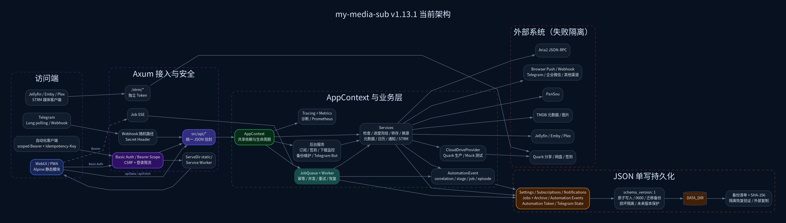

# My Media Sub 当前架构

> 本文以 `main`（v2.2.10）为准，只描述当前仍在运行的结构与约束。阶段进度见 [`roadmap.md`](roadmap.md)，HTTP 细节见 [`api-contract.md`](api-contract.md)，自动化与 Telegram 的安全合同分别见 [`automation-api.md`](automation-api.md) 和 [`telegram-bot.md`](telegram-bot.md)。

## 架构图



- [SVG](architecture.svg)
- [Graphviz 源文件](architecture.dot)

重新生成：

```bash
dot -Tsvg docs/architecture.dot -o docs/architecture.svg
dot -Tpng -Gdpi=160 docs/architecture.dot -o docs/architecture.png
```

## 设计边界

My Media Sub 是面向单实例管理员的自托管应用，不是多租户平台。当前基线坚持以下约束：

1. **单实例、单管理员安全模型**：管理 WebUI 使用 Basic Auth；自动化调用使用最小 scope Bearer Token；Telegram 身份不等同于系统用户。
2. **JSON 单写**：业务状态写入 `DATA_DIR` 下的版本化 JSON Store，不启用 SQLite、双写或外部数据库。
3. **服务层是业务入口**：HTTP、调度器、Job Worker 和 Telegram 命令复用同一 Service/Store 合同，不在适配层复制业务规则。
4. **长操作进入 JobQueue**：转存、元数据、推送等长任务持久化、幂等、可取消、可重试并支持重启恢复。
5. **外部系统失败隔离**：PanSou、夸克、TMDB、Aria2、媒体库、推送和 Telegram 的失败不能中断核心 Store 或其他流水线。
6. **敏感数据不外泄**：日志、诊断、错误响应和审计不回显 Cookie、Token、密码、Webhook Secret 或完整敏感 URL。

## 运行时分层

| 层级 | 主要位置 | 责任 |
|---|---|---|
| 进程入口 | `src/main.rs` | 加载配置、初始化 tracing、构建 `AppContext`、启动 Axum 与后台服务。 |
| 依赖装配 | `src/app.rs` | 单次创建并共享 Store、Service、Provider Registry、JobQueue、调度器、Metrics、备份和 Telegram Bot。 |
| HTTP 与认证 | `src/api/mod.rs` | 路由装配、Basic/Bearer 认证、CSRF、登录限流、安全头、统一 API 错误和静态资源。 |
| API Handler | `src/api/*` | 参数解析、权限后的短操作、长任务入队、标准响应序列化。 |
| 业务 Service | `src/services/*` | 检查、完结/进度、转存、换源、日历、元数据、通知、下载、备份和生命周期治理。 |
| 转存后处理模块 | `src/services/post_transfer.rs` | 通过对象安全 Rust trait 挂载媒体库刷新等只读后处理；模块失败不回滚已持久化转存。 |
| Job 系统 | `src/jobs/*` | 持久化队列、公平调度、分层并发、幂等、重试、取消、SSE 和重启恢复。 |
| 云盘抽象 | `src/providers/*` | `CloudDriveProvider` 能力边界；生产仅注册 Quark，Mock 用于确定性测试。 |
| 外部客户端 | `src/clients/*` | PanSou、夸克、Aria2 和共享 HTTP pool；TMDB 客户端逻辑位于 metadata service。 |
| 数据模型 | `src/models/*` | Subscription、Settings、Metadata、Calendar、AutomationEvent、Notification 和规则结构。 |
| JSON Store | `src/store/*`、`src/jobs/store.rs` | schema 解码、内存索引、原子落盘、权限修复、损坏隔离和未来版本保护。 |
| WebUI/PWA | `static/*` | Alpine.js 静态模块、响应式界面、PWA 壳层、SSE/轮询和 OpenAPI 页面。 |
| 运维工具 | `src/utils/*`、`scripts/*` | 指标、时间/文件安全、契约检查、发布/升级/浏览器/持续运行 smoke。 |

## 请求与认证边界

```text
浏览器 ── Basic Auth + 同源 CSRF ──┐
自动化客户端 ── scoped Bearer ─────┼─> Axum API -> Service / JobQueue -> Store
Telegram ── 随机路径 + Header Secret ┘
媒体客户端 ── STRM Token ─────────────> /strm/* -> Quark
健康探针 ─────────────────────────────> /health
```

- 普通业务 API 返回 `{"ok":true,"data":...}`；错误返回 `{"ok":false,"error":"...","message":"..."}`。
- `/health` 免认证；`/strm/*` 使用独立 Token；Telegram Webhook 在专用 Handler 中校验随机路径和 Secret Header。
- Bearer Token 只允许路由声明的最小 scope。设置、Token 管理、备份恢复、Store 清理和在线升级不向自动化 Token 开放。
- `/metrics`、诊断、Telegram 审计等管理信息仍需 Basic Auth 或 `diagnostics:read`。
- 所有请求生成或继承安全格式的 request/correlation ID；自动化事件继续关联 subscription/job/episode。

## 核心业务链路

### 订阅检查与完结状态

```text
SubscriptionScheduler / API / Telegram
  -> SubscriptionCheckService
  -> CloudDriveProvider::probe
  -> 文件与剧集识别、规则过滤、同集版本选择
  -> 原子更新 SubscriptionStore
  -> JobQueue(转存/推送) + AutomationEvent
```

- `completed`/`status=completed` 是后端根据发现、转存或下载证据写入的权威状态，前端不得用展示进度反向覆盖。
- `notify_only` 从已发现目标集判定完结；普通自动转存从已转存目标集判定；启用同步下载时由下载监控在目标下载完成后判定。
- 元数据、总集数或规则变化会重新协调完结状态；异常的超范围集号不能把订阅误标为完结。

### 元数据与日历缩略图

- TMDB 搜索结果会补充剧集、季和图片信息；刷新同一 provider/item 时合并已有图片与缺失季详情，避免上游部分失败清空缩略图和排期。
- 日历缩略图优先级为剧集 still → 当前季 poster → 媒体 poster。
- `MediaCalendarService` 是从 Subscription、Job、Notification 和 AutomationEvent 快照计算出的只读视图，不维护第二份日历 Store。

### 转存与下载

```text
检查结果 -> SubscriptionTransfer Job -> CloudDriveProvider::transfer
         -> 重命名 -> Aria2（可选同步下载）-> DownloadMonitor
         -> 媒体库刷新（PostTransferModule）-> Notification / Push / AutomationEvent
```

STRM 自 v2.2.0 起模块级下线（`STRM_MODULE_ENABLED=false`），转存链路不再生成 STRM；settings 中仍保留字段以便日后以独立模块接回。每个阶段使用稳定幂等键和 correlation；Job 的业务结果与 AutomationEvent、Notification、Metrics 各自承担不同职责，不能互相替代。

## 后台执行

`AppContext` 统一启动：

- Subscription Scheduler：按配置检查启用且未真正完结的订阅；
- Quark Sign-in Scheduler：执行夸克专属签到；
- Job Worker：执行 manual transfer、subscription transfer、metadata scrape 和 push dispatch；
- Download Monitor：轮询 Aria2、记录完成状态并触发后续动作；
- Backup maintenance：定时备份、隔离恢复验证和可选外部复制；
- Telegram Bot：`disabled`、long polling 或 webhook 三选一，故障与普通通知/核心流水线隔离；
- Job event projection：把 Job 状态投影到结构化 AutomationEvent。

## 持久化与恢复

主要文件：

```text
DATA_DIR/
  settings.json
  subscriptions.json
  notifications.json
  jobs.json
  jobs.archive.json
  automation_events.json
  automation-token.json
  telegram_bot.json
  backups/
```

Store 共同合同：

- `schema_version: 1` 信封、旧格式迁移和一次性 `*.schema-v0.bak`；
- 临时文件 + flush/fsync + 原子 rename，写盘成功后才替换内存状态；
- Unix 敏感文件权限修复为 `0600`；
- 损坏文件隔离，未来 schema 拒绝并保留原始文件；
- 订阅、Job 和自动化事件使用内存索引，历史按独立保留策略清理；
- 恢复前预览逐文件路径、schema、大小和 SHA-256，执行恢复前再创建当前快照。

达到规模阈值只会进入 `decision_required`；在明确迁移方案、可重复导入、计数/校验和验证和回滚合同完成前，不创建 SQLite 或长期双写。

## 前端与 PWA

前端不使用打包器，`static/app.js` 只组合各模块的 Alpine store：

```text
static/js/
  core/       api, router, polling, notifications, ux, shell
  stores/     subscriptions, jobs, drive, downloads
  features/   dashboard, calendar, search, settings, diagnostics,
              subscription-detail, source-switch, automation-events, pwa, updates
```

- `apiData()` 处理标准成功信封；`apiFetch()` 保留状态码/响应头语义。
- Job 优先使用 SSE，断线后有界重连；下载、通知和页面数据使用具备生命周期清理的轮询。
- 高频 `x-for` 列表必须使用唯一且可恢复的渲染 key；外部图片加载失败后必须允许新 URL 或重试恢复。
- Service Worker 只缓存应用壳层：HTML network-first，静态资源 stale-while-revalidate；API、health、跨域和非 GET 永不缓存。
- 修改任何静态资源时必须提升 `CACHE_VERSION`，发布时二进制和完整 `static/` 必须配套替换。

## 可观测性、安全与数据生命周期

- HTTP、外部依赖、慢操作、队列、Store I/O、备份和自动换源指标通过 JSON 与 Prometheus 暴露；
- tracing 支持 text/JSON 与运行时 EnvFilter 更新；敏感字段在进入日志前脱敏；
- 诊断包只包含脱敏配置状态、聚合指标和修复建议；
- 通知、Job、自动化事件和订阅历史均有独立保留上限；清理必须先预览并创建可恢复备份；
- Telegram Update/Callback 幂等、确认 nonce、审计和限流状态持久化且有界保留。

## 扩展接入点

| 变更 | 首选接入点与必须同步内容 |
|---|---|
| 新 API | `src/api/*` + `static/openapi.json` + `scripts/check-openapi.py` + 集成测试。 |
| 新长任务 | `JobKind`/payload + 稳定幂等键 + `src/jobs/worker/` handler + 重启/取消/重试测试。 |
| 新外部服务 | `src/clients/*` 或独立 Service，复用共享 HTTP pool、观测和错误脱敏。 |
| 新云盘 | 实现 `CloudDriveProvider` 并注册；签到等厂商专属能力留在 trait 外。 |
| 新 Store | Model + schema/迁移/备份/损坏/未来版本/保存失败测试 + 生命周期策略。 |
| 新通知事件 | `PushEvent` + Notification metadata + 路由/静默期/限频规则。 |
| 新自动化能力 | 最小 Token scope + 幂等合同 + OpenAPI/示例；不得开放备份恢复和任意命令。 |
| 新 WebUI 页面 | 独立 feature/store 模块 + `app.js` 装配 + Node 测试 + PWA precache（若运行必需）。 |

## 当前明确不包含

- 第二个生产 CloudDriveProvider；
- NAS 同步；
- SQLite 或其他数据库后端；
- 多用户、租户和群组权限模型；
- 任意 Shell、任意文件读取或远程 Store 编辑入口。
