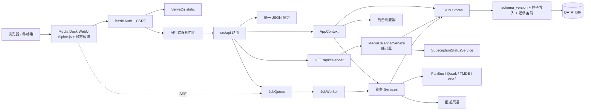
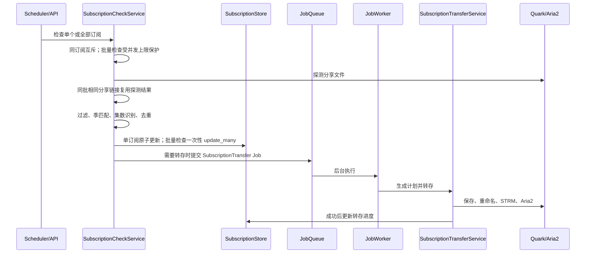
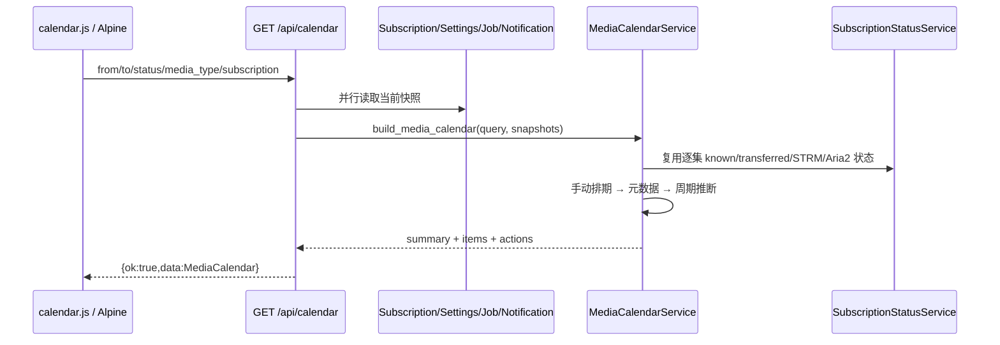

# My Media Sub 架构说明

> 本文描述当前工作树的 **v1.3.0 开发基线**。后续任务和完成状态以 [`roadmap.md`](roadmap.md) 为准，HTTP 响应约定以 [`api-contract.md`](api-contract.md) 为准，媒体日历规则以 [`media-calendar.md`](media-calendar.md) 为准。

## 架构图


- PNG：[architecture.png](architecture.png)
- SVG：[architecture.svg](architecture.svg)
- Graphviz 源文件：[architecture.dot](architecture.dot)

重新生成：

```bash
dot -Tsvg docs/architecture.dot -o docs/architecture.svg
dot -Tpng -Gdpi=160 docs/architecture.dot -o docs/architecture.png
```

## 总览



## 运行时分层

| 层级 | 目录/文件 | 当前责任 |
|---|---|---|
| 入口 | `src/main.rs` | 加载启动配置、日志、创建 AppContext、启动 Axum。 |
| 依赖装配 | `src/app.rs` | 初始化 Store、Service、JobQueue、Worker、调度器和 Metrics。 |
| HTTP 中间件 | `src/api/mod.rs` | Basic Auth、CSRF、API 非 JSON 错误规范化、静态资源和路由合并。 |
| API 契约 | `src/api/response.rs`、`src/error.rs` | 成功/错误 JSON 信封和安全错误消息。 |
| API 路由 | `src/api/*` | 请求解析、短操作、长任务入队、日历查询和响应序列化；subscriptions/drive 使用职责目录模块。 |
| 业务服务 | `src/services/*` | 订阅检查、状态/日历聚合、转存、规则、元数据、推送、签到、STRM 和下载监控。 |
| 后台任务 | `src/jobs/*` | Job 持久化、排队、取消、重试、重启恢复和 Worker 执行。 |
| 外部客户端 | `src/clients/*` | PanSou、夸克、TMDB、Aria2 及共享 HTTP client 池。 |
| 数据模型 | `src/models/*` | Settings、Subscription、Calendar、Notification、Job、Metadata、Rules 等结构。 |
| 持久化 | `src/store/*` | schema 解码、迁移、原子写入、权限修复和损坏文件隔离。 |
| 前端 | `static/*` | Media Deck HTML、Alpine 状态、预编译 Tailwind CSS 和可测试功能模块。 |
| 通用工具 | `src/utils/*` | 原子文件操作、时间、常量时间比较和轻量指标。 |

## HTTP 请求路径

### 普通 API

```text
浏览器
  → Basic Auth / CSRF
  → API 错误规范化中间件
  → src/api/* 路由
  → AppContext / Service / Store / JobQueue
  → {ok:true,data:...} 或 {ok:false,error,message}
  → apiData()/apiFetch()
```

约束：

- 401、403、已知/未知 404、405 和请求解析错误都返回 JSON；
- 401 保留 `WWW-Authenticate`；
- 5xx 只向客户端返回安全消息，内部细节写日志；
- `/health`、`/strm/*`、Job SSE 和 204 操作是登记过的例外；
- `GET /api/calendar` 使用标准成功信封，不维护独立缓存或持久化副本；
- 具体契约见 [`api-contract.md`](api-contract.md)。

### 静态资源与 STRM

- `ServeDir` 从 `static/` 提供首页、CSS、Alpine 和功能模块；
- 静态资源仍经过 Basic Auth；
- `/health` 免鉴权；
- `/strm/quark/*` 不走 Basic Auth，使用独立 STRM Token 并直接代理媒体流；
- API 错误规范化中间件不会包装静态资源和 STRM 响应。

## 前端结构

当前前端保持无打包器、无 Node 运行时：

```text
static/
  index.html
  app.js                     # 仅组合 Alpine stores
  styles.css
  vendor/alpine.min.js
  js/
    core/
      api.js
      formatters.js
      router.js
      notifications.js
      polling.js
      shell.js
    stores/
      subscriptions.js
      jobs.js
      downloads.js
      drive.js
    features/
      search-results.js
      subscription-detail.js
      calendar.js
      source-switch.js
      automation-events.js
      search-page.js
      calendar-page.js
      updates.js
      settings.js
      dashboard.js
```

职责：

- `app.js` 只按 descriptor 组合各领域 store，并暴露 Alpine `app()`；getter 不会在装配时被提前求值；
- `core/shell.js` 负责初始化、主题、全局快捷键和页面刷新；
- `core/router.js` 负责 tab/settings/subscription 路由、History state 和页面副作用切换；
- `core/polling.js` 统一命名 timer、事件监听器和 EventSource 生命周期，页面切换和 Alpine `destroy()` 时清理；
- `core/notifications.js` 负责通知中心、Toast 和通知轮询；
- `core/api.js` 统一网络、HTTP 和新旧响应兼容；
- `core/formatters.js` 统一时间、容量、速度和时长；
- `features/search-results.js` 负责搜索结果分析、筛选与排序；
- `features/subscription-detail.js` 负责剧集状态和活动视图工具；
- `features/calendar.js` 负责自然周/月范围、日期移动、月/周单元格、列表分组和状态/来源/可信度标签；
- feature 模块优先承载可测试纯逻辑，业务权威规则仍位于 Rust 服务；
- Router、Toast、Polling、Downloads、Drive、Updates、Settings、Dashboard 和 Subscriptions 已按 roadmap 完成渐进拆分；仍保持无打包器、无框架迁移。

## JSON 存储

持久化文件：

```text
DATA_DIR/
  settings.json
  subscriptions.json
  notifications.json
  jobs.json
```

当前格式：

```json
{
  "schema_version": 1,
  "data": {}
}
```

不变量：

1. 旧裸对象/数组按 v0 解码并迁移到 v1；
2. 迁移前先保存一次性 `*.schema-v0.bak` 原始字节；
3. 原文件和迁移备份在 Unix 上修复为 `0600`；
4. 写入使用临时文件、`fsync` 和原子 rename；
5. 写盘成功后才替换内存快照；
6. 未来 schema 返回启动错误，但不隔离、不覆盖原文件；
7. 真正损坏的 JSON 移动为 `.corrupt-<timestamp>`；
8. v1.3.0 不提升 schema，`Subscription.manual_schedule` 使用 `serde(default)` 兼容历史数据；
9. `SubscriptionStore::mutate_snapshot/update_many` 在独占保存锁内构造完整快照，写盘成功后才替换内存；
10. 批量订阅检查在内存 Store 执行，全部任务结束后只向真实 Store 提交一次；
11. 当前继续使用 JSON，达到 roadmap 中的规模阈值后才评估 SQLite。

## 关键业务流程

### 订阅检查和转存



### 订阅详情聚合

`SubscriptionStatusService` 以订阅为主实体，读取：

- Subscription 的元数据、已知集数和转存记录；
- Settings 的 STRM/Aria2 配置；
- JobStore 的任务历史；
- NotificationStore 的转存、下载和推送记录。

输出剧集网格、缺集列表、流水线摘要和活动时间线。AutomationEventStore 记录 source_check、file_filter、version_select、cloud_transfer、rename、strm、aria2、notification 阶段；历史通知 metadata 仅作为兼容补充来源。

### 媒体更新日历



关键约束：

- 业务日期统一按 `Asia/Shanghai` 固定 UTC+08:00 解释；
- 默认查询当前周一至周日，`from` / `to` 是闭区间，最长 367 个自然日；
- `manual_schedule` 优先于元数据，但不会修改原始 `MediaMetadata`；
- `UpdateSubscriptionRequest.manual_schedule` 使用字段存在感知：缺失保持不变，`null` 清除；
- 日历计算不写回 Store，状态判定复用订阅详情聚合结果；
- `check_weekdays` 只控制检查调度，不参与播出日推导。

### Job 和实时状态

- 长耗时动作进入 JobQueue；
- JobStore 持久化最近任务、优先级和幂等键并支持安全恢复；同键 queued/running 任务只保留一个，旧任务缺少 priority 时兼容为 normal；
- `FairScheduler` 对 high/normal/low 使用 3:2:1 加权调度，并在同优先级内按订阅轮转，既优先交互任务又避免低优先级饿死；
- Worker 原子认领 queued 任务后并发执行，按动态设置实施全局、transfer/metadata/push 类别和同订阅互斥三层限制；无订阅 ID 的批量元数据任务与订阅范围任务互斥；
- ManualTransfer、SubscriptionTransfer、MetadataScrape 和 PushDispatch 各有独立 handler，Worker 根模块只负责调度、分发、状态、取消和错误收口；
- 重启时 running 任务标记为中断，重复 queued 任务以及 interrupted 任务的重复副本不会重新入队；
- `POST /api/jobs/{id}/priority` 可调整 queued 任务优先级；运行中或终态任务拒绝调整；
- Job 持久化 attempt、next_attempt_at 和 error_class；限流、临时网络、内部和超时错误最多自动执行 3 次，采用指数退避及 ±20% 可复现抖动，手动转存因副作用不自动重试；
- transfer/metadata/push 分别维护熔断状态，连续 3 次可重试失败后打开 60 秒，随后只允许一个半开恢复探测；成功探测关闭熔断；
- 单次执行超过 30 分钟由 timeout 卡死检测终止；维护模式只暂停新认领，不中断运行中任务；100 条 queued 触发每小时最多一次通知；
- 活跃 Job Store 保留最近 300 条终态历史，较旧记录原子写入 `jobs.archive.json`（最多 5,000 条），通过 `GET /api/jobs/archive` 分页查询并随 DATA_DIR 备份；
- 浏览器通过 `/api/jobs/events` 接收初始快照和后续更新；
- 页面轮询只用于 Aria2、通知、在线更新等没有 SSE 的状态。

### 通知策略与渠道

- 业务先写 Notification，再以 detached task 提交 PushDispatch Job；渠道失败只回写推送报告，不向订阅检查、转存、下载监控或签到传播。
- PushService 按事件开关、最低级别、上海时区安静时段和 `push_event_routes` 计算最终渠道；错误级别可配置为绕过安静时段。
- 重复通知按事件/标题/正文和时间窗口限频；摘要模式原子领取 `digest_pending` 通知并生成单条摘要 Job，多个定时器不会重复消费。
- 模板支持 title/message/event/level 变量并提供只读预览；Webhook 每个目标独立执行三次退避重试。
- Webhook 签名轮换在最长 168 小时重叠期同时发送 `X-Media-Sub-Signature-256` 与 `X-Media-Sub-Signature-256-Previous`，上一密钥始终按 secret 脱敏。

### CloudDriveProvider

- `providers::CloudDriveProvider` 定义分享探测、目录列举/查找/确保、转存、重命名、删除、下载信息和健康检查能力；
- `CloudDriveProviderRegistry` 根据订阅 `cloud_type` 解析 Provider，空值兼容旧数据并归一化为 `quark`；
- `QuarkCloudDriveProvider` 是当前唯一生产实现，业务 Service 不接触 `QuarkSaveClient`；
- `MockCloudDriveProvider` 支持检查、转存和失败注入测试；
- 夸克签到是供应商专属扩展，由 `QuarkSigninService` 维护，不属于通用 Provider 接口；
- 第二 Provider 只有在出现明确产品需求后才加入。

### 备份、诊断与安全

- `BackupService` 把 DATA_DIR 中除备份目录和瞬态文件外的普通文件封装为带格式版本、schema、大小和 SHA-256 的自描述 JSON 归档；
- 定时备份遵守保留数与总存储预算，恢复前始终创建当前快照；恢复只接受规范相对路径，拒绝保留位置、路径穿越和符号链接祖先，完成后写入重启要求；
- `/api/diagnostics` 只返回配置状态和聚合运行数据，不返回 Cookie、Token、密码或分享链接；诊断包使用相同脱敏模型；
- 每个响应携带 request ID 和 correlation ID，自动化业务继续使用自身 correlation ID 串联阶段事件；
- 指标覆盖检查/转存耗时、失败阶段、队列、换源、备份和恢复；
- Basic Auth 失败使用 60 秒滑动窗口限速；CSP 和通用安全头由顶层中间件统一设置；
- 恢复和删除操作在浏览器确认之外还需要服务端可验证确认值。

### JSON Store 可观测性与规模决策

- `decode_store_json` 统一记录文件大小、解析耗时和失败；`write_json_atomic_async` 记录紧凑 JSON 写入字节与耗时；
- 通知、Job、自动化事件和订阅内历史均有明确保留上限，维护接口可重新整理并压缩全部 Store；
- SubscriptionStore 和 JobStore 使用主键索引，AutomationEventStore 使用订阅/correlation/job 多索引；
- 诊断页根据 500 订阅、10,000 历史、32 MiB 文件和复杂查询四项门槛输出 JSON/SQLite 决策；
- 未达到门槛时不引入 SQLite；未来迁移必须保留 JSON、可重复、校验计数和校验和、可回滚且切换后不双写。

### PWA 与移动端

- `manifest.webmanifest` 提供 standalone 安装、any/maskable 图标和六类业务快捷入口；
- `service-worker.js` 对 HTML 使用 network-first，对静态资源使用 stale-while-revalidate；
- `/api/*`、`/strm/*`、`/health`、跨域和非 GET 请求始终 network-only；
- 只有 200 且未声明 `private/no-store` 的响应可缓存，Basic Auth 401/403 不缓存且 HTML 不回退离线壳层；
- 认证后的壳层预热覆盖全部运行必需 JS/CSS/图标，但不包含任何业务 JSON；
- Cache Version 激活时删除旧缓存，安装中的新 Worker 由用户确认后 `SKIP_WAITING`；
- 390px 断点压缩 Header、内容边距和快捷入口，不裁剪完整导航能力。

### 在线更新

1. 查询 GitHub Release；
2. 下载 `.tar.gz` 和 `.sha256`；
3. 校验 SHA256 并解压；
4. 将当前 `static/` 重命名为 `static.bak-<timestamp>`；
5. 复制新静态资源，失败时恢复旧目录；
6. 将当前二进制复制为 `my-media-sub.bak-<timestamp>`；
7. 原子替换二进制；
8. 保存重启计划，由用户确认重启。

数据文件不由在线更新器覆盖；schema v1 迁移由各 Store 在启动时执行。v1.3.0 不提升 schema，但二进制和 `static/` 必须配套升级。

## 新功能接入点

| 功能 | 首选接入点 |
|---|---|
| 新 WebUI 页面 | `static/index.html` + 独立 `static/js/features/*.js`，再由 `app.js` 装配。 |
| 新后端接口 | `src/api/*.rs`，使用统一 Response/AppError，并在 `src/api/mod.rs` 注册。 |
| 新日历来源或状态 | `src/models/calendar.rs` + `services/media_calendar.rs` + `docs/media-calendar.md` + API/前端测试。 |
| 新长任务 | `JobKind` + payload + 稳定幂等键 + queue submit + `src/jobs/worker/` 独立 handler。 |
| 新订阅规则 | `src/models/rules.rs` + `services/transfer_rule.rs` + API schema + UI。 |
| 新持久化数据 | Model + Store + schema 迁移/备份/未来版本/损坏/失败测试。 |
| 新外部 API | `src/clients/*`，复用 HTTP pool，不在 API 层复制客户端逻辑。 |
| 新云盘 | 实现 `CloudDriveProvider` 并在 registry 注册；供应商扩展能力保持在通用 trait 之外。 |
| 新通知事件 | `services/push.rs` 的 PushEvent 和结构化 notification metadata。 |
| 新指标 | `src/utils/metrics.rs`，通过 `/api/metrics` 暴露。 |
| 新后台调度器 | `src/services/*_scheduler.rs`，由 AppContext 初始化和启动。 |

## 当前边界与下一步

尚未完成、不得在文档中视为已有能力：

- 第二个生产 CloudDriveProvider（需明确产品需求）；
- PWA；
- SQLite；
- Telegram 主动控制；
- NAS 同步。

完整顺序和状态见 [`roadmap.md`](roadmap.md)。
