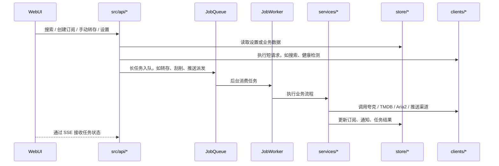

# My Media Sub 架构说明

本文描述 1.0.0 版本的当前代码结构，方便判断后续功能应该接入到哪个层级。

## 图片版


- PNG：[architecture.png](architecture.png)
- SVG：[architecture.svg](architecture.svg)

## 总览

```mermaid
flowchart LR
  User[浏览器用户] --> WebUI[静态 WebUI<br/>static/index.html<br/>static/app.js<br/>static/styles.css]
  WebUI --> Axum[Axum HTTP Server<br/>src/main.rs]
  Axum --> Auth[Basic Auth 中间件<br/>src/api/mod.rs]
  Auth --> Static[静态资源<br/>ServeDir static/]
  Auth --> ApiRoutes[API 路由层<br/>src/api/*]

  ApiRoutes --> AppContext[AppContext<br/>src/app.rs]
  AppContext --> Stores[JSON Store<br/>settings / subscriptions / notifications / jobs]
  Stores --> DataFiles[DATA_DIR JSON 文件]

  AppContext --> Services[业务服务层<br/>src/services/*]
  AppContext --> JobQueue[JobQueue<br/>src/jobs/queue.rs]
  JobQueue --> JobWorker[JobWorker<br/>src/jobs/worker.rs]
  JobWorker --> Services

  Services --> Clients[外部客户端<br/>src/clients/*]
  ApiRoutes --> Clients
  Clients --> HttpPool[共享 HTTP client 池<br/>src/clients/http_pool.rs]
  Clients --> PanSou[PanSou API]
  Clients --> Quark[夸克分享 / 网盘 / 签到 API]
  Clients --> TMDB[TMDB API]
  Clients --> Aria2[Aria2 JSON-RPC]

  Services --> Push[PushChannel 派发<br/>企业微信 / Telegram / Bark / Gotify 等]
  Services --> Strm[HTTPStrm 代理<br/>/strm/*]
  Strm --> Quark

  WebUI -.SSE.-> JobsEvents[/api/jobs/events]
  JobsEvents --> JobQueue
  WebUI -.metrics.-> Metrics[/api/metrics]
```

## 主要分层

| 层级 | 目录/文件 | 责任 |
| --- | --- | --- |
| 入口 | `src/main.rs` | 加载配置、初始化日志、创建 `AppContext`、启动 Axum。 |
| 依赖装配 | `src/app.rs` | 初始化 Store、Service、JobQueue、调度器和指标句柄。 |
| API 层 | `src/api/*` | HTTP 路由、请求/响应结构、鉴权后的业务调用。 |
| 业务层 | `src/services/*` | 订阅检查、转存、规则、推送、STRM、元数据、签到等核心逻辑。 |
| 后台任务 | `src/jobs/*` | 长耗时任务队列、任务状态、取消/重试、worker 执行。 |
| 外部客户端 | `src/clients/*` | PanSou、夸克、Aria2、共享 HTTP client 等外部 API 封装。 |
| 数据模型 | `src/models/*` | 订阅、设置、通知、搜索、规则、元数据等结构体。 |
| 持久化 | `src/store/*` | JSON 文件读取、原子写入、写锁串行化、损坏文件隔离。 |
| 前端 | `static/*` | Alpine WebUI、预编译 CSS、SSE 任务状态订阅。 |
| 工具 | `src/utils/*` | 时间、原子文件写入、常量时间比较、轻量指标。 |

## 关键流程



## 新功能接入点

| 想加的功能 | 通常改哪里 |
| --- | --- |
| 新 WebUI 页面或按钮 | `static/index.html`、`static/app.js`，必要时新增 `src/api/*` 路由。 |
| 新后端接口 | 新增或扩展 `src/api/*.rs`，在 `src/api/mod.rs` 里 `.merge()`。 |
| 新外部服务 | 新增 `src/clients/*.rs`，复用 `http_pool`，再由 `services` 或 `api` 调用。 |
| 长耗时动作 | 在 `src/jobs/model.rs` 加 `JobKind` 和 payload，在 `queue.rs` 暴露 submit 方法，在 `worker.rs` 执行。 |
| 新配置项 | `src/models/settings.rs`、`src/api/settings.rs`、`.env.example`、README 配置表、WebUI 设置页。 |
| 新持久化数据 | 新增 `models` 结构和 `store`，在 `AppContext` 初始化并传入需要的 API/Service。 |
| 新后台调度器 | 新增 `services/*_scheduler.rs`，在 `AppContext::new` 初始化，在 `start_background_services()` 启动。 |
| 新通知/推送事件 | `src/services/push.rs` 加 `PushEvent`，业务服务里调用通知记录和推送派发。 |
| Telegram 主动控制 | 后续新增独立服务，复用现有 `Search` API、`JobQueue`、订阅 Store 和推送消息格式。 |

## 当前扩展建议

- Telegram 主动控制可以作为独立长驻服务挂到 `AppContext`，但命令执行应复用现有 API/Service，避免复制搜索、订阅和转存逻辑。
- 新媒体源应先在 `clients` 层归一化搜索结果，再进入现有订阅/转存流程。
- 新规则优先扩展 `models/rules.rs` 和 `services/transfer_rule.rs`，再暴露到订阅创建/编辑 UI。
- 新指标优先添加到 `src/utils/metrics.rs`，再通过 `/api/metrics` 暴露。
